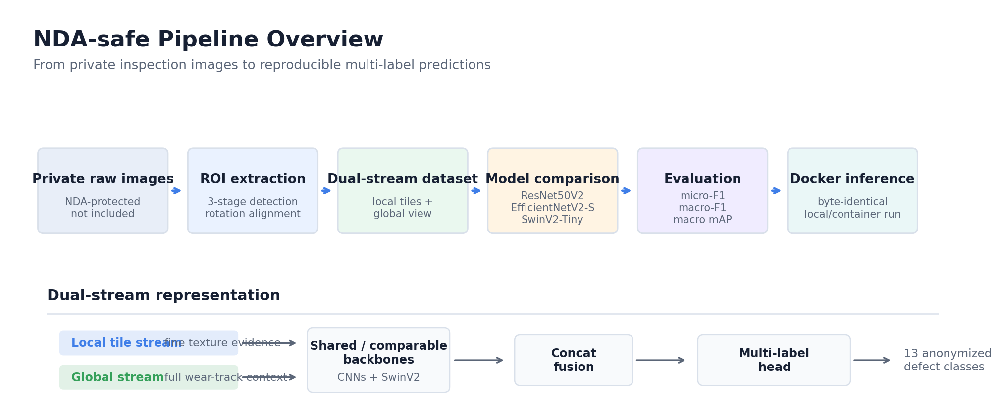
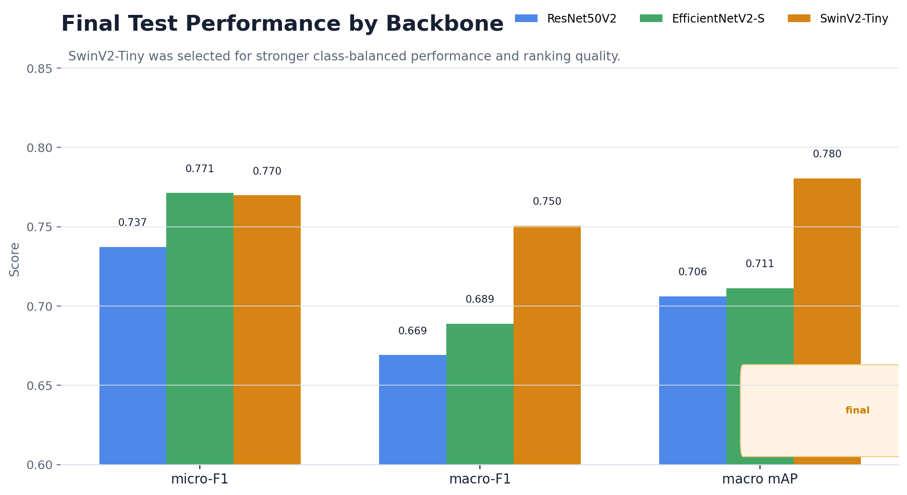

# Industrial Wear Image Classification

> Multi-label deep-learning pipeline for surface-defect classification:
> ROI extraction &rarr; dual-stream dataset &rarr; SwinV2 / CNN classifier &rarr;
> reproducible Docker inference.

## Overview

End-to-end computer-vision pipeline for multi-label classification of surface
wear patterns on coated industrial samples. Designed for a small,
class-imbalanced dataset with subtle visual differences between defect types.

- **1,100 inspection images, 13 multi-label defect classes**
- Dual-stream architecture: fine-grained **local tiles** + macro **global view**
- Three backbones compared: ResNet50V2, EfficientNetV2-S, **SwinV2-Tiny** (final)
- Robust preprocessing: 3-stage ROI detection cascade with rotation alignment
- Multi-label-aware probe-level data split (no tile leakage)
- GPU Docker image with byte-identical local-vs-container outputs (MD5 verified)

> This repository is an **NDA-safe portfolio version** of the project. It focuses
> on the engineering methodology and reusable implementation patterns; private
> data, trained weights, and partner-specific labels are intentionally excluded.

> **Note on data.** Training images, the original label taxonomy, and the
> industry partner's identity are covered by an NDA and **cannot be
> redistributed or described in detail**. This repository documents the
> **methodology and code**. Aggregate statistics and benchmark numbers are
> reported; concrete class names are anonymized.

## Pipeline overview



## Pipeline (step-by-step)

Each step is its own notebook &mdash; key code + rationale, no boilerplate.

| # | Notebook | What it covers |
|---|----------|----------------|
| 1 | [`01_roi_extraction`](notebooks/01_roi_extraction.ipynb) | 3-stage detection cascade &rarr; rotation &rarr; fixed-canvas crop |
| 2 | [`02_dual_stream_dataset`](notebooks/02_dual_stream_dataset.ipynb) | CLAHE normalization &rarr; local tiles + global view |
| 3 | [`03_multilabel_split`](notebooks/03_multilabel_split.ipynb) | Rare-class-first probe-level greedy split &rarr; CSV manifest |
| 4 | [`04_model_architecture`](notebooks/04_model_architecture.ipynb) | SwinV2 / CNN dual-stream design with concat fusion |
| 5 | [`05_training_strategy`](notebooks/05_training_strategy.ipynb) | Sync augmentation, `pos_weight` BCE, AdamW + warmup-cosine, AMP loop |
| 6 | [`06_evaluation_thresholding`](notebooks/06_evaluation_thresholding.ipynb) | Per-class F1-optimal threshold tuning, mAP / micro-F1 / macro-F1 |
| 7 | [`07_deployment`](notebooks/07_deployment.ipynb) | GPU Dockerfile, `infer.py`, MD5 reproducibility check |

## Preprocessing variants

Two synchronized preprocessing variants feed two different model families.
Both share the same detection, normalization, and split logic; only
resolutions and split ratios differ.

| Variant | ROI canvas | Tile | Global view | Split | Target model |
|---------|-----------|------|-------------|-------|--------------|
| `cnn`   | 2000 &times; 700  | 320 &times; 320 | 915 &times; 320  | 70 / 20 / 10 | ResNet50V2, EfficientNetV2-S |
| `swin`  | 3000 &times; 1050 | 448 &times; 448 | 1280 &times; 448 | 75 / 15 / 10 | **SwinV2-Tiny** (final) |

> **Why the split ratio differs.** Swin Transformer is more sensitive to
> training-set size than CNN baselines, so the Swin variant allocates an
> additional 5% to training. The CNN baselines are comparatively stable under
> smaller training sets, so 70/20/10 was kept as the canonical CNN split.

## Final results (test set)

| Model (Dual-Stream) | Thresholding | micro-F1 | macro-F1 | mAP (macro) |
|---------------------|--------------|----------|----------|-------------|
| ResNet50V2          | Fixed 0.5    | 0.7372   | 0.6691   | 0.7061 |
| EfficientNetV2-S    | Fixed 0.5    | **0.7713** | 0.6888 | 0.7112 |
| **SwinV2-Tiny**     | Per-class    | 0.7698   | **0.7505** | **0.7805** |

SwinV2-Tiny was selected as the production model based on macro-F1 and mAP
&mdash; the metrics that matter most under heavy class imbalance.



## Deployment

The trained classifier is packaged into a GPU Docker image based on the
official PyTorch 2.9.1 / CUDA 12.8 runtime. Inference is verified to produce
**byte-identical predictions** between local and containerized runs:

```bash
$ md5sum predictions.csv predictions.docker.csv
18d3a45584d42371ad12a1e65330840a  predictions.csv
18d3a45584d42371ad12a1e65330840a  predictions.docker.csv
```

See [`notebooks/07_deployment.ipynb`](notebooks/07_deployment.ipynb) for the
Dockerfile, `infer.py` flow, and run commands.

## Project layout

```
.
├── README.md
├── LICENSE
├── requirements.txt
├── configs/
│   └── preprocessing_config.yaml      # CNN + Swin variants (reference)
├── docs/
│   └── images/                        # NDA-safe diagrams and aggregate charts
└── notebooks/
    ├── 01_roi_extraction.ipynb
    ├── 02_dual_stream_dataset.ipynb
    ├── 03_multilabel_split.ipynb
    ├── 04_model_architecture.ipynb
    ├── 05_training_strategy.ipynb
    ├── 06_evaluation_thresholding.ipynb
    └── 07_deployment.ipynb
```

## License

[MIT](LICENSE) &mdash; covers only the code in this repository. Note that the
training data, original label taxonomy, trained weights, and industry partner
identity remain covered by a separate NDA and are not included here.

## Quick start

```bash
pip install -r requirements.txt
jupyter notebook notebooks/
```

Run the seven notebooks in order. Each one is self-contained and exposes a
handful of small functions you can import or adapt. Because the dataset and
trained weights are private, the notebooks are intended as a reproducible
methodology reference rather than a fully runnable demo.
